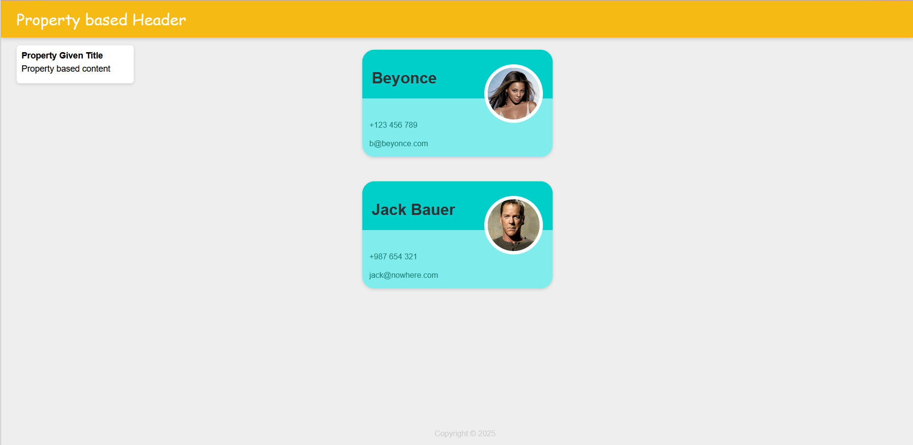

# 🚀 React Learning

A personal project created to capture and grow my React knowledge. It serves as a structured foundation where I apply what I learn throughout a [React Udemy course](https://www.udemy.com/course/the-complete-web-development-bootcamp/learn/lecture/17039094#overview), modularizing my progress step by step.

<br>

## Table of Contents

1. [📖 Overview](#-overview)
2. [🖼️ Current Template Preview](#-current-template-preview)
3. [🧑‍💻 Usage](#-usage)
4. [🛠️ Setup & Structure](#-setup--structure)
8. [🚀 Summary](#-summary)

<br>

# 📖 Overview

This repository reflects my learning journey in React. It's not just a codebase—it's a living template that expands as I go deeper into React fundamentals, patterns, tooling, and ecosystem insights. The goal is to have a robust base I can reuse for future projects or as a reference.

Each module is clearly separated and well-documented.

<br><br>

# 🖼️ Current Template Preview

Here's what the current template looks like:



<br><br>

# 🧑‍💻 Usage

You can clone and run any module using the following commands:

```bash
git clone https://github.com/Sokrates1989/react-tutorial.git

cd <module-name>

docker compose up
```


<br><br>

# 🛠️ Setup & Structure

Modules are directly added to the root as directories such as "Keepa", "props", "..."

The living template resides at "/template"

<br><br>


# 🚀 Summary

✅ **Structured, modular learning project**

✅ **All code fully commented and organized**

✅ **Growing knowledge base with practical examples**

✅ **Perfect starter template for future React projects**

